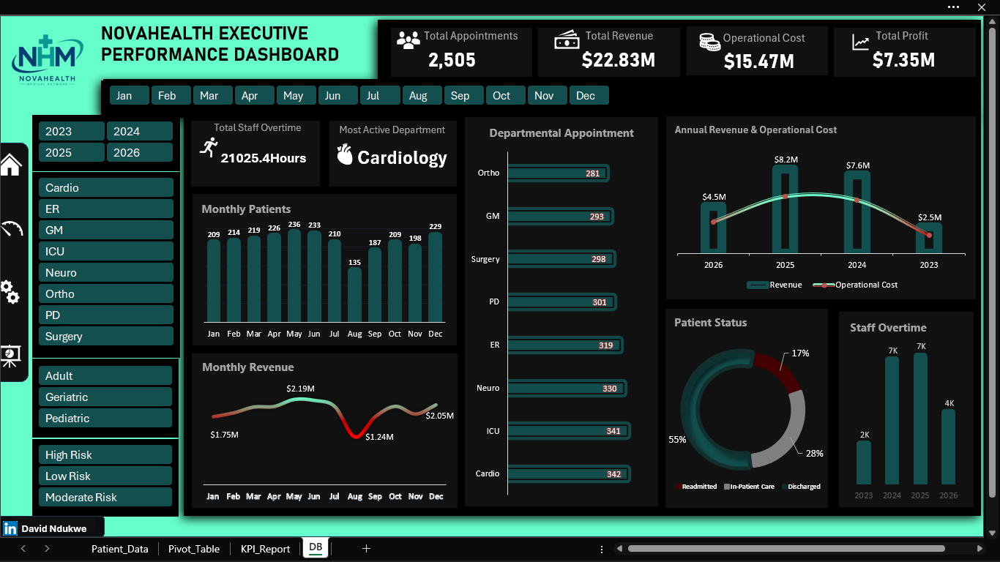
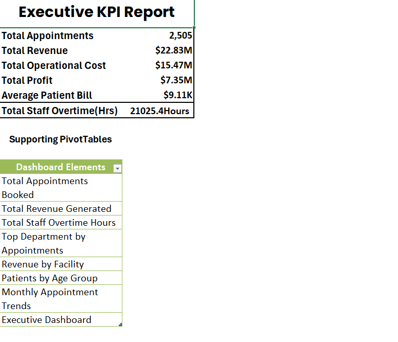
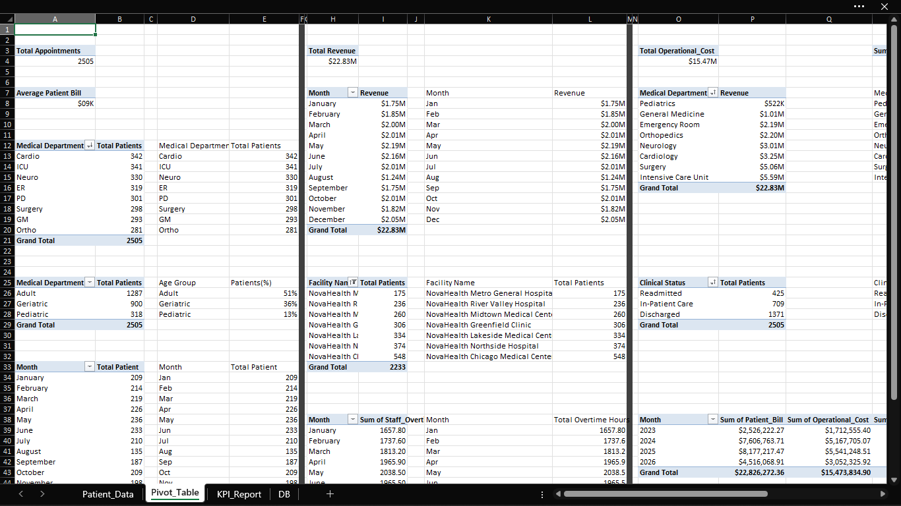

# 🏥 NovaHealth Executive Operations Dashboard

An Excel-based executive reporting case study, self-designed to teach Pivot Table,
KPI reporting, and dashboard-building skills to healthcare operations analysts.

## Business Problem

NovaHealth Medical Network (a fictional multi-facility healthcare provider I designed
for this case study) had a clean, standardized patient operations dataset but no
centralized KPI reporting or executive dashboard. Leadership had no way to monitor
patient volume, revenue, operational cost, staff overtime, or departmental performance
without manually digging through raw records — slowing decision-making on staffing,
resource allocation, and facility performance.

## My Role

I designed this case study end-to-end — the fictional company, the business questions,
the dataset structure, and the full analysis — as a teaching exercise to walk others
through executive-level Excel reporting: from raw data to Pivot Tables to an
interactive dashboard.

## Approach

1. Designed a realistic healthcare operations dataset (2,505 patient records across
   8 medical departments and multiple facilities) with a documented data dictionary
2. Built Pivot Tables to summarize patient activity, financial performance,
   departmental operations, and workforce utilization
3. Extracted key metrics into an Executive KPI Report using cell references and
   Month-on-Month performance tracking
4. Built an interactive Excel dashboard with Pivot Charts, KPI cards, slicers
   (year, department, age group, risk tier), and a timeline for dynamic filtering

## Key Insights

- Total revenue reached **$22.83M** across 2,505 appointments, with an operational
  cost of **$15.47M** — a **$7.35M profit margin (~32%)**
- **ICU, Cardiology, and Neurology** were the highest-volume departments by
  appointments — this concentration is worth flagging against the **21,025 total
  staff overtime hours** logged, since high-volume departments are the most likely
  source of overtime strain and a candidate for staffing review
- Patient status breakdown shows **17% readmission rate** — this is a meaningful
  signal worth investigating further, as elevated readmission can point to gaps in
  discharge planning or follow-up care protocols
- Monthly revenue and patient volume both show clear seasonal dips (e.g. a
  pronounced drop mid-year), suggesting demand planning and staffing schedules
  could be adjusted proactively around these patterns rather than reactively

## Recommendations

- Cross-reference the highest-overtime departments (ICU, Cardiology) against
  current staffing ratios — sustained overtime at this volume (21K+ hours) is a cost
  and burnout risk that Pivot-level department reporting alone won't fix, but it's the
  first data point that should trigger a staffing review
- Investigate the drivers behind the 17% readmission rate before assuming it's a
  clinical issue — worth checking whether it correlates with specific departments,
  age groups, or risk tiers using the dashboard's existing slicers
- Use the seasonal patient volume dips visible in the monthly trend to inform
  proactive scheduling, rather than treating each low-volume month as an anomaly

## Tools

Microsoft Excel — Pivot Tables, Pivot Charts, slicers, KPI cell-reference reporting,
interactive dashboard design

## Dataset

Self-designed synthetic healthcare operations dataset — 2,505 records, 18 fields
(patient demographics, admission details, department, billing, operational cost,
staff overtime, clinical status, risk tier). Full data dictionary in [`docs/data_dictionary.md`](docs/data_dictionary.md).
Patient names removed prior to publishing.

## Screenshots

## Impact Statement

This case study demonstrates end-to-end executive reporting capability in Excel —
from raw data design through Pivot Table analysis to an interactive dashboard —
and was built specifically to teach these skills to others, reflecting both technical
Excel depth and the ability to communicate analytical concepts clearly.
